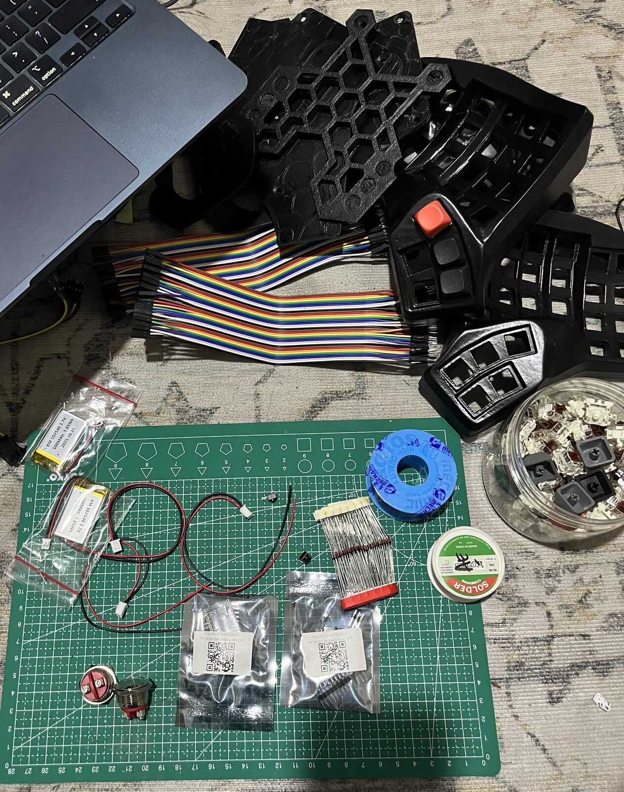
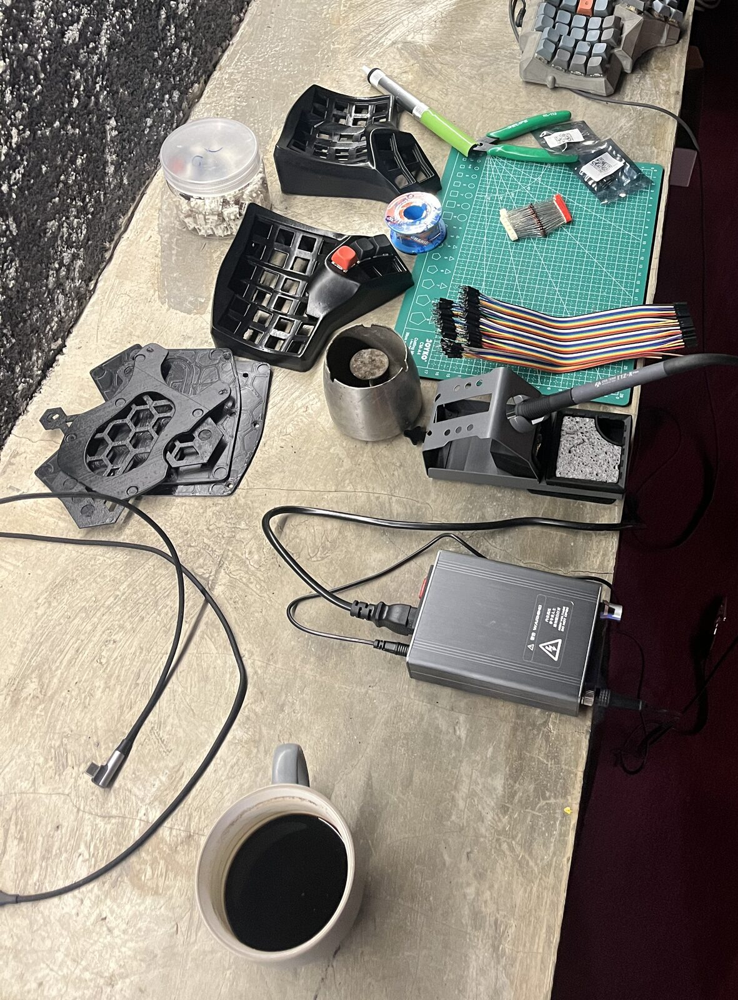
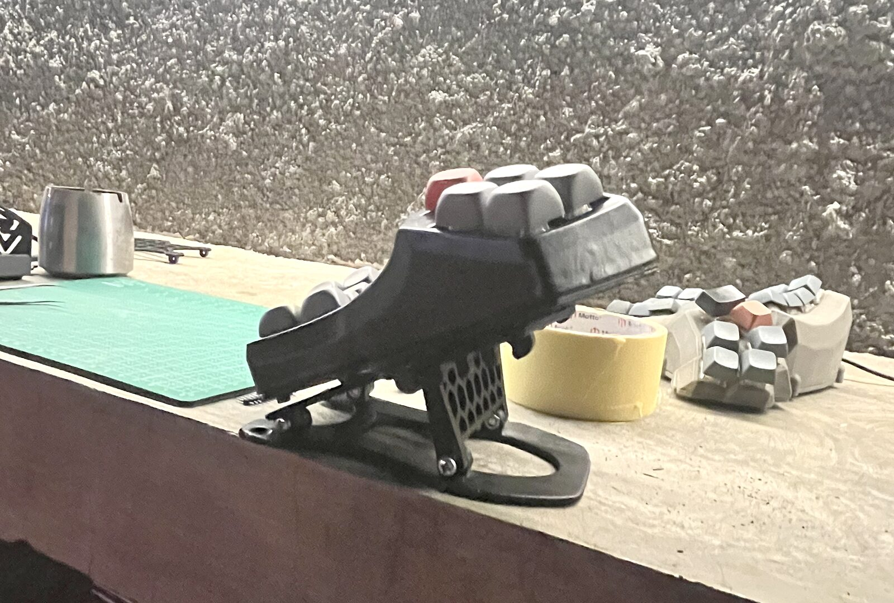
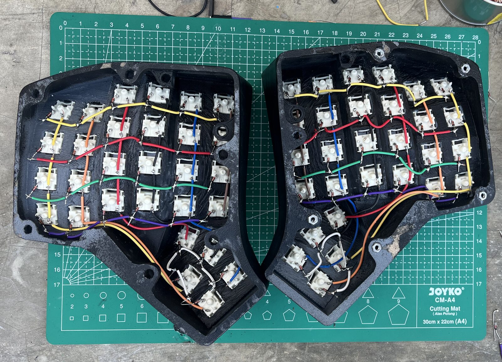
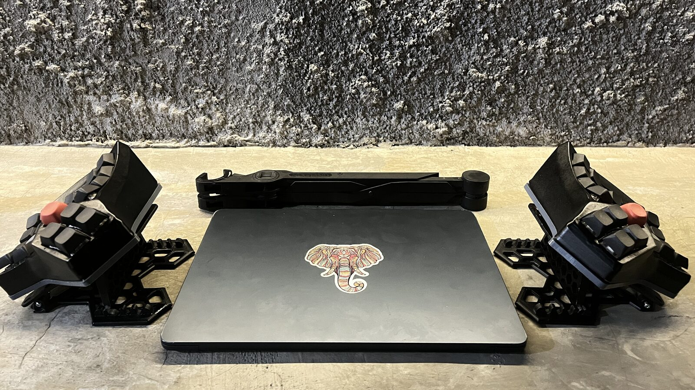
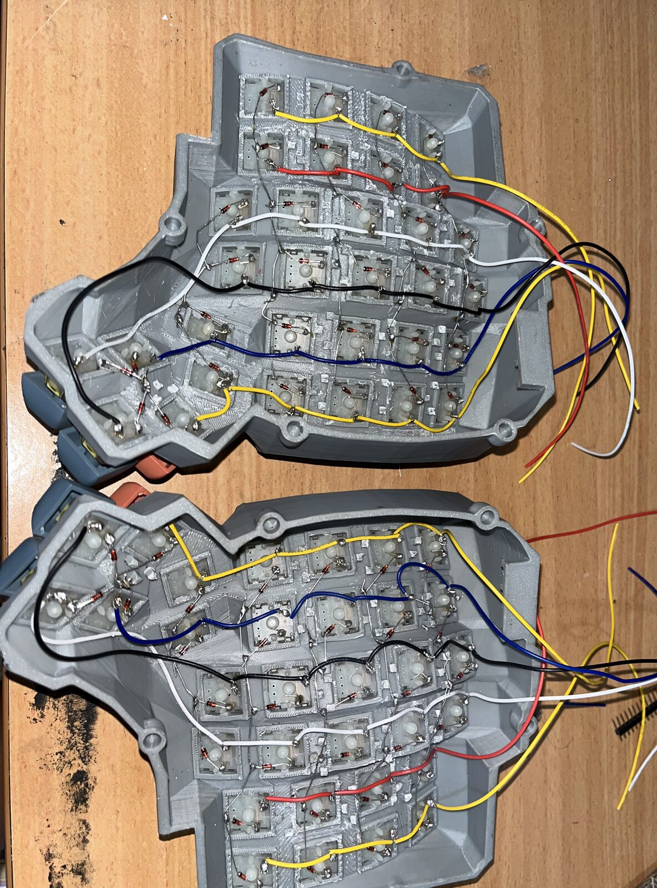

# Build log

From a pile of printed parts to a working wireless split, in about four weeks.
Dates are local time (WIB). Details live in the linked notes, this page is the
timeline.

| Date | What happened |
|---|---|
| Nov 2024 | [Previous build](#previous-build-nov-2024): a handwired Dactyl |
| 27 Jun 2026 | Project start |
| 30 Jun 2026 | Handedness correction: the upstream STL names are mirrored |
| 5 Jul 2026 | Integrated tent cover verified against the official plate |
| 7 to 9 Jul 2026 | Tent plate print failures, then the two fixes that made it print |
| 13 Jul 2026 | [Parts on the bench](#parts-and-bench-13-jul-2026), soldering starts |
| 14 Jul 2026 | [First half on the tenting stand](#on-the-tenting-stand-14-jul-2026) |
| 16 Jul 2026 | [Both matrices wired](#matrix-wired-16-jul-2026) |
| 19 Jul 2026 | Keymap remapped, clone-board firmware findings written down |
| 25 Jul 2026 | [Final setup](#final-setup-25-jul-2026) |

## Printing (27 Jun to 9 Jul 2026)

- **Handedness.** The Scylla files in the upstream repo are named the wrong way
  round: `scylla_v3_36.stl` is the left case and `..._plate_right.stl` is the
  left plate. Verified by render comparison and plate IoU. The corrected table
  is in [`PRINT-QUEUE.md`](../PRINT-QUEUE.md).
- **Tent cover.** The seal plate and the hinge were fused into one part that
  replaces the plain bottom plate. Outline IoU against the official plate:
  0.9989.
- **Tent plate.** About ten failed flat prints in one session. Two root causes:
  the plate has to be printed vertically, and Z0 drifts by about ±0.15 mm on
  every `G28`, so the fix was to home once, paper-verify, and print with the
  re-home stripped from the gcode. Full write-up in
  [`tools/tent/PRINT-FINDINGS.md`](../tools/tent/PRINT-FINDINGS.md).

## Parts and bench (13 Jul 2026)

Both cases and the tenting stand parts printed, next to the electronics: two
nRF52840 controllers, two LiPo cells, 1N4148 diodes, jumper ribbon and a jar of
switches. Sourcing notes are in [`SHOPPING-LIST.md`](../SHOPPING-LIST.md).

## On the tenting stand (14 Jul 2026)

First half bolted to its tenting stand: plate hinged to the base, the arm
setting the angle. The grey keyboard behind it is the previous build.

## Matrix wired (16 Jul 2026)

Both halves wired: one diode per switch, soldered straight to the switch pins,
no hotswap sockets and no PCB. The wiring sheet is `preview-wiring.html`.

## Firmware (19 Jul 2026)

Two findings specific to the HwThinker clone boards, both fixed in
[charybdis-wireless-zmk](https://github.com/arisros/charybdis-wireless-zmk):

- No 32.768 kHz crystal, so the BLE split link timed out and the right hand was
  dead until `CONFIG_CLOCK_CONTROL_NRF_K32SRC_RC=y` forced the internal RC
  oscillator.
- `P0.22` is not usable as GPIO on this board (QSPI flash), so Col1 moved to
  `P0.31`.

The base layer was remapped the same day (thumbs, pinky and Home), see
`preview-keymap.html`.

## Final setup (25 Jul 2026)

## Previous build (Nov 2024)

The keyboard this one replaces: a handwired Dactyl. It shows up in the
background of a few of the photos above.
